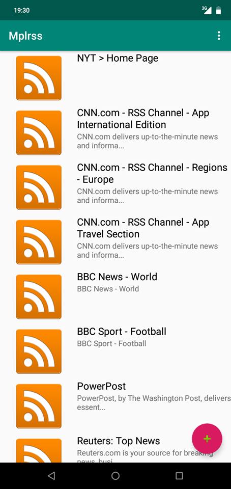
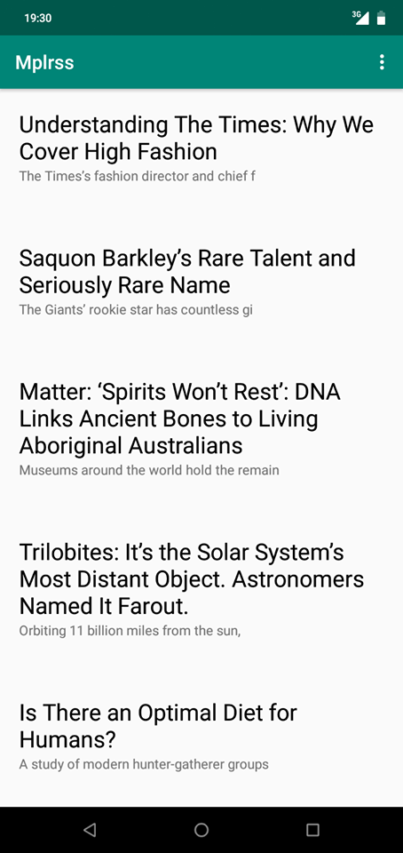

# RSS_Reader

Simple application android pour lecture des flux RSS dans le cadre du projet semestriel du module programmation composantes mobiles (Master 1 Informatique Université Paris 7)

**NB:** Le content provider de cette application est dans un [repo](https://github.com/yacine17/MplrssServer) différent.

